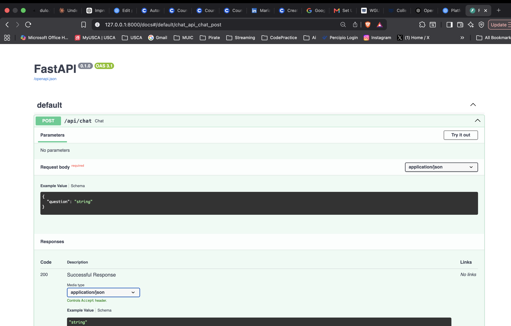
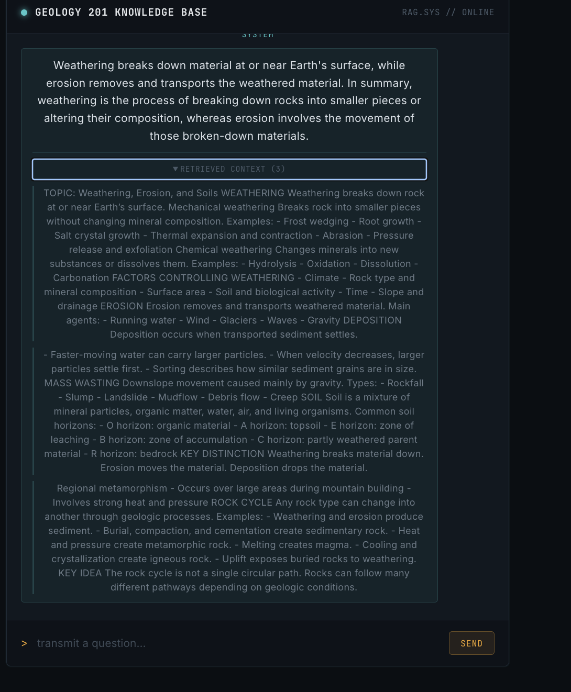
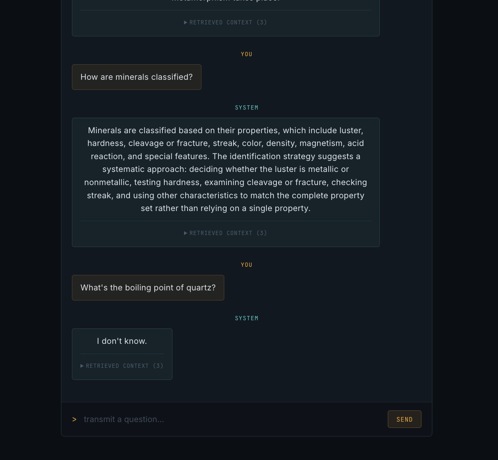

#Geology Knowledge Base — My First RAG App

This is my first hands-on build of a **RAG (Retrieval-Augmented Generation)** application — a chatbot that answers questions using my own documents instead of just general AI knowledge.

I'm marking this as a checkpoint, not a finished product. The goal was to actually understand how RAG works end to end by building the simplest possible version myself, rather than starting with a framework that hides the mechanics. Future me may look back on this and cringe a little at how basic it is — that's the point.

## What it does

- Reads a folder of plain `.txt` documents
- Splits them into chunks and converts each chunk into an embedding (a vector representing its meaning) using OpenAI's embedding model
- When I ask a question, it embeds the question the same way, compares it against every stored chunk using cosine similarity, and pulls the most relevant ones
- Those chunks get stuffed into a prompt along with my question, and sent to `gpt-4o-mini` to generate an answer
- Answers stream in word-by-word, and I can expand a "retrieved context" panel under each answer to see exactly which chunks it used — this was the most useful feature for actually trusting (or debugging) the system

I started with a sample dataset about drone fundamentals, then swapped in my real GEOL 201 course notes to see if it held up on material I actually needed to study.

## Screenshots

<!-- Add your screenshots into a folder called docs/screenshots/ in this repo,
     then update the paths below to match. -->

**Initial test via FastAPI's auto-generated docs page:**


**Working chat UI with retrieved context expanded:**


**Answering correctly from real course notes:**


## Tech stack

- **Backend:** Python, FastAPI, OpenAI API (`text-embedding-3-small`, `gpt-4o-mini`), numpy for similarity math
- **Frontend:** React (Vite), plain CSS
- **Vector storage:** none — just an in-memory Python list. No real vector database yet, which was a deliberate choice to keep the mechanics visible

## What's deliberately missing (on purpose)

This was built to be a floor, not a ceiling. Things I know a "real" version would need that I intentionally skipped:

- A real vector database (Chroma, Pinecone, etc.) instead of an in-memory list
- Smarter chunking (currently just splits every 120 words, which can cut sentences awkwardly)
- Persistent storage — right now, restarting the server re-embeds everything from scratch
- Authentication, rate limiting, and other production concerns

## Running it locally

**Backend:**
```
cd backend
python -m venv .venv
.venv\Scripts\activate      # Mac/Linux: source .venv/bin/activate
pip install -r requirements.txt
```
Create a `.env` file in `backend/` with:
```
OPENAI_API_KEY=your-key-here
```
Then run:
```
uvicorn main:app --reload
```

**Frontend:**
```
cd frontend
npm install
npm run dev
```

Drop your own `.txt` files into `backend/docs/` before starting the backend, and it'll build its index from whatever's in there.

## What I learned

- What an embedding actually is, and why cosine similarity is the mechanism that makes retrieval work
- Why chunking strategy matters more than I expected — poor chunk boundaries can genuinely hurt retrieval quality
- The difference between a plain LLM API call and a RAG pipeline, and where the "augmented" part actually happens
- How streaming responses work under the hood (generators, `StreamingResponse`, reading a `ReadableStream` on the frontend)
- FastAPI over Flask, and oxlint over ESLint, for a small solo project like this

---

*Built as a learning project — July 2026. Next stop: a real vector database, once I actually need one.*
